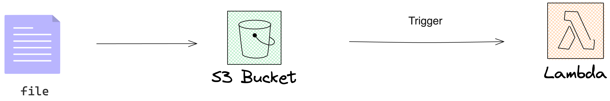

# ATELIER 4

### Objectifs :

On souhaite créer un module dans le répertoire "module".

1. Dans le fichier "main.tf", nous souhaitons :

   - Créer un bucket S3.
   - Créer une fonction Lambda.
   - Mettre en place une notification S3 qui déclenche la fonction Lambda.
   - Configurer les autorisations nécessaires pour exécuter la fonction Lambda.

2. Créer des variables pour les éléments suivants :
   - Le nom du bucket S3 : "bucket_name".
   - Le nom de la fonction Lambda : "lambda_name".
   - L'emplacement du code de la Lambda : "code_archive".

3. Créer deux sorties (outputs) :
   - Le nom du compartiment S3 : "output_bucket_name".
   - Le nom de la fonction Lambda : "output_lambda_name".

4. Générer la documentation avec terraform-docs.

Indications :

- Pour la fonction Lambda :
   - Utilisez le code situé dans le répertoire : "data/lambda.zip".
   - La handler : "lambda_function.lambda_handler".
   - La runtime : "python3.10".

- Vous pouvez trouver un exemple de code dans la documentation Terraform.